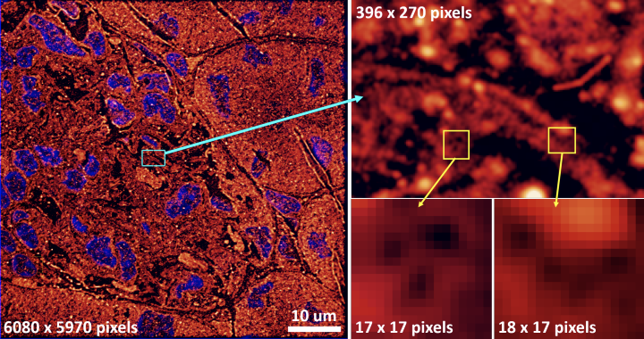
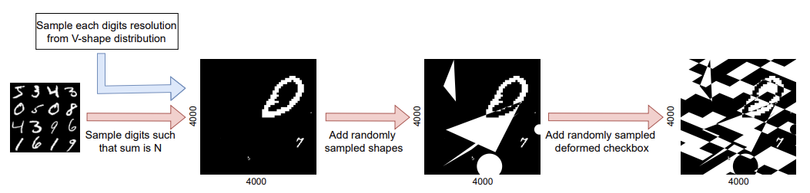
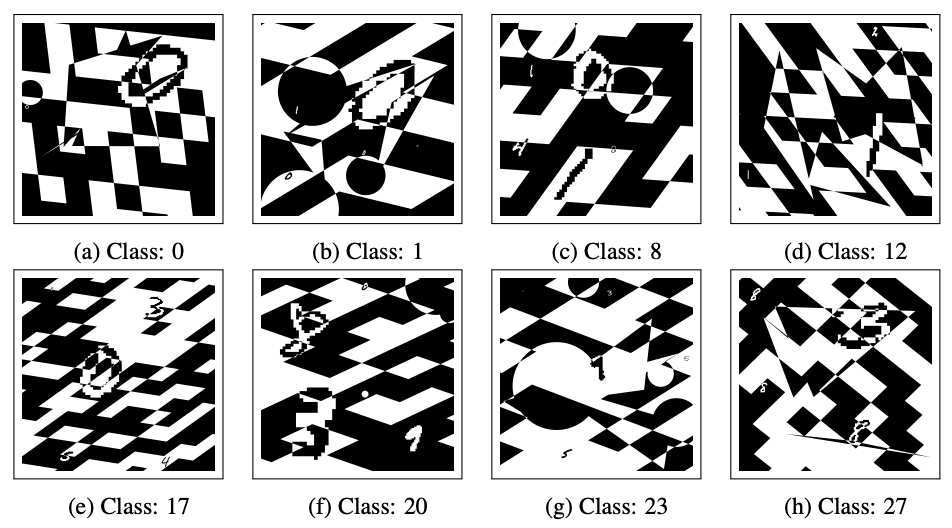
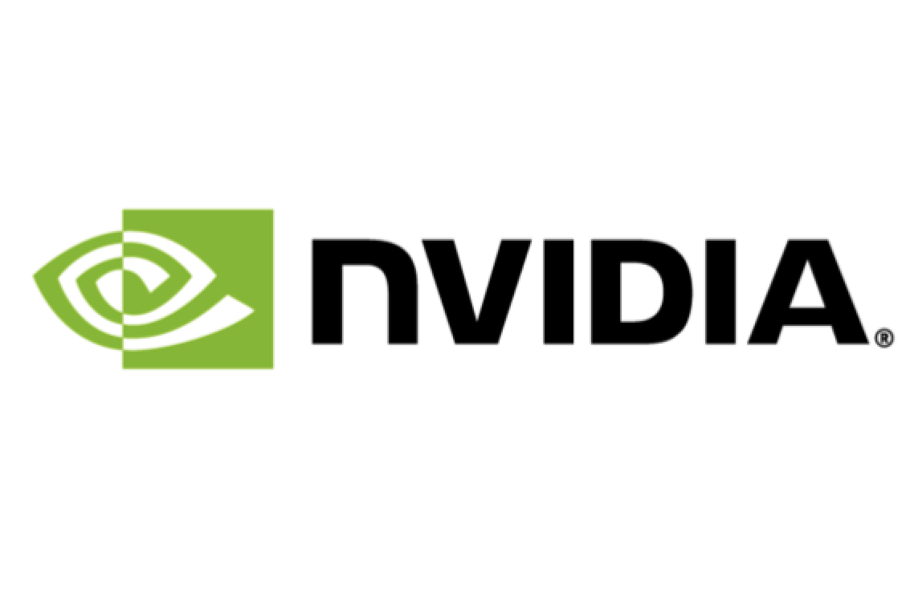

## Motivation

Convolutional neural networks are known to be very powerful feature descriptors, especially due to their capability of extracting very complex hidden features which cannot be sensed by the traditional computer vision methods. Due to this, it has been used widely for applications related to natural images. However, for cases where the images are very large, using the conventional CNN models is not straightforward. Examples of such images include large satellite images, biomedical outputs, among others. Strategies to handle them include downscaling the images or breaking them into smaller tiles. With downscaling, the small-scale features are lost, and there can be instances when this is not desired. When breaking into tiles, the large features may not be captured within a single tile, leading to the breakage of semantic connection across tiles. While several tricks exist to handle the issue to a certain extent, an elegant and well-defined pipeline to train CNN with such images is still missing in the existing literature.

<p align="center">
  
</p>

<div align="center">On the left is a nanoscopy image of mouse kidney cryo-section approximately 1/12th of the
area of a single field-of-view of the microscope, chosen to illustrate the level of details at different
scales. The bottom right images show that the smallest features in the image of relevance to biological
factors can be as small as a few pixels (here 5-8 pixels for the holes)</div>


## Research Ideation  

  
<div align="center">Schematic workflow for the generation of UltraMNIST samples</div>


Convolutional neural network (CNN) approaches available in the current literature are designed to work primarily with low-resolution images. When applied on very large images, challenges related to GPU memory, smaller receptive field than needed for semantic correspondence and the need to incorporate multi-scale features arise. The resolution of input images can be reduced, however, with significant loss of critical information. Based on the outlined issues, we introduce a novel research problem of training CNN models for very large images, and present ‘UltraMNIST dataset’, a simple yet representative benchmark dataset for this task. UltraMNIST has been designed using the popular MNIST digits with additional levels of complexity added to replicate well the challenges of real-world problems. We present two variants of the problem: ‘UltraMNIST classification’ and ‘Budget-aware UltraMNIST classification’. The standard UltraMNIST classification benchmark is intended to facilitate the development of novel CNN training methods that make the effective use of the best available GPU resources. The budget-aware variant is intended to promote development of methods that work under constrained GPU memory. For the development of competitive solutions, we present several baseline models for the standard benchmark and its budget-aware variant. We study the effect of reducing resolution on the performance and present results for baseline models involving pretrained backbones from among the popular state-of-the-art models. Finally, with the presented benchmark dataset and the baselines, we hope to pave the ground for a new generation of CNN methods suitable for handling large images in an efficient and resource-light manner. 


## Problem description

\

We pose the problem of the classification of UltraMNIST digits. UltraMNIST dataset comprises very large-scale images, each of 4000x4000 pixels with 3-5 digits per image. Each of these digits has been extracted from the original MNIST dataset. Your task is to predict the sum of the digits per image, and this number can be anything from 0 to 27.


## Challenge Organizer team

 

**Sponsor**




Transmute AI Lab and MLSpace have teamed up to organise this competition in collaboration with colleagues from UiT The Arctic University of Norway. Transmute AI Lab is a research group working on fundamental problems at the intersection of efficient deep learning and computer vision. MLSpace is a discord community of 10000+ data science & machine learning professionals, beginners and enthusiasts. Together they are working towards tackling the issue of handling large images with CNN, with focus on biomedical and aerial applications.


## BibTeX
```
misc{https://doi.org/10.48550/arxiv.2206.12681,
  doi = {10.48550/ARXIV.2206.12681},
  url = {https://arxiv.org/abs/2206.12681},
  author = {Gupta, Deepak K. and Bamba, Udbhav and Thakur, Abhishek and Gupta, Akash and Sharan, Suraj and Demir, Ertugrul and Prasad, Dilip K.},
  keywords = {Computer Vision and Pattern Recognition (cs.CV), FOS: Computer and information sciences, FOS: Computer and information sciences},
  title = {UltraMNIST Classification: A Benchmark to Train CNNs for Very Large Images},
  publisher = {arXiv},
  year = {2022},
  copyright = {Creative Commons Attribution Share Alike 4.0 International}
}

```

### Support or Contact

Having trouble with Pages? Please [contact support]() and we’ll help you sort it out.
